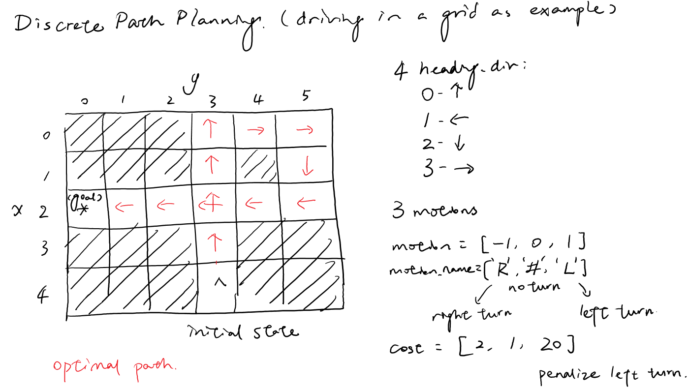
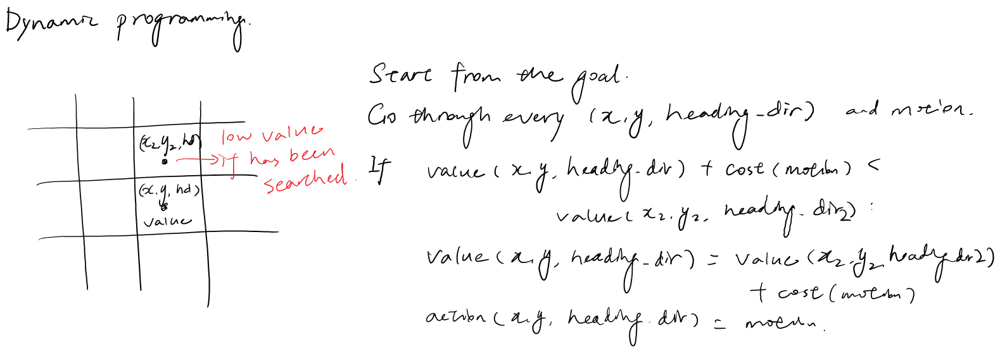

# Motion-Planning-Search-Algorithm


# A* 
 
Code:  
```python
for i in range(len(action)):
    # Calculate new location and heading direction
    heading_dir2=(heading_dir+action[i])%len(forward)
    x2 = x + forward[heading_dir2][0]
    y2 = y + forward[heading_dir2][1]
    # Check if the new location is feasible
    if x2 >= 0 and x2 < len(grid) and y2 >=0 and y2 < len(grid[0]) and \
      closed[x2][y2][heading_dir2][i] == 0 and grid[x2][y2] == 0:
        g2 = g + cost[i] 
        h2 = heuristic[x2][y2]
        f2 = g2 + h2
        open.append([f2, g2, h2, x2, y2, heading_dir2])
        closed[x2][y2][heading_dir2][i] = 1
        # If the new location has been reached before,
        # check if the new search has lower cost.
        # If yes, update the action
        if g2<total_cost[x2][y2][heading_dir2]:
            total_cost[x2][y2][heading_dir2]=g2
            action_all[x2][y2][heading_dir2]=i
            print(x2,y2,heading_dir2,i)
```

# Dynamic Programming
 
